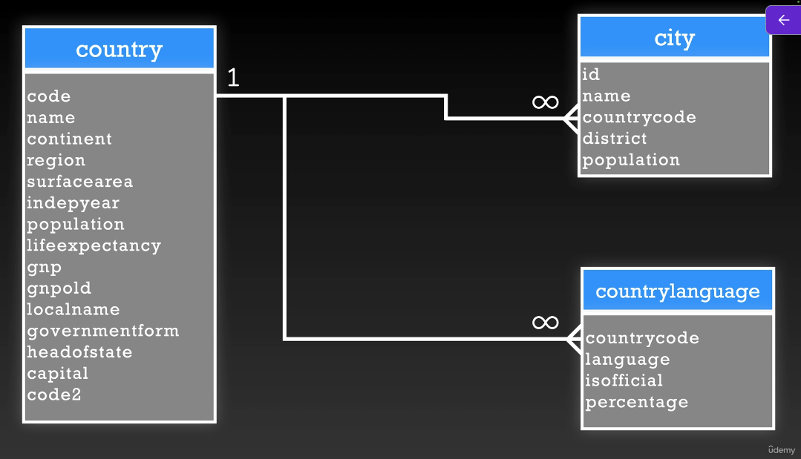
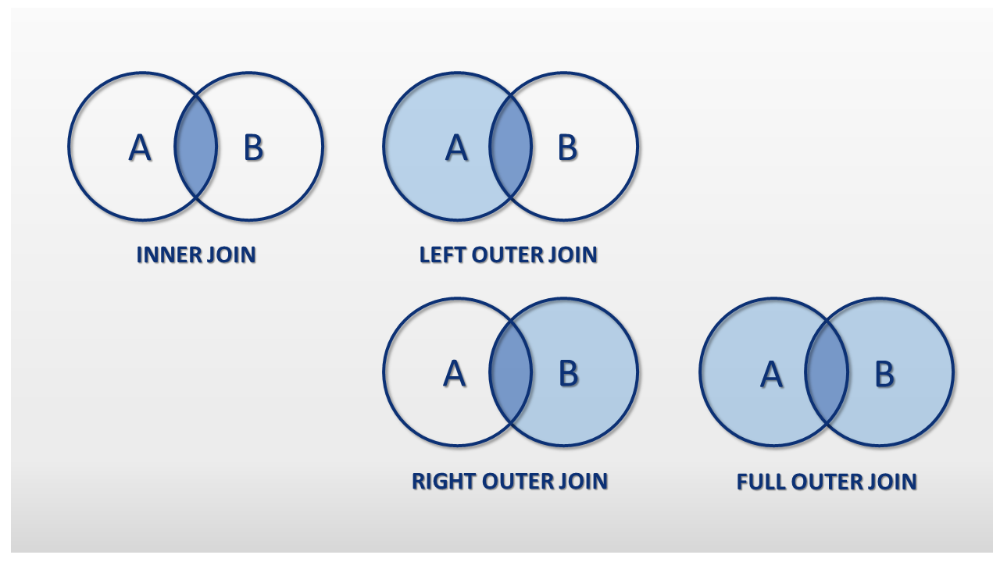
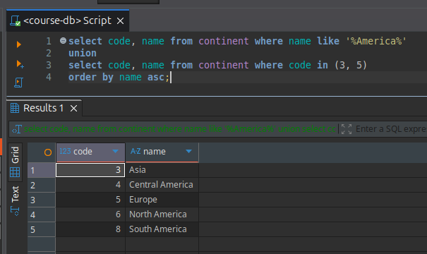
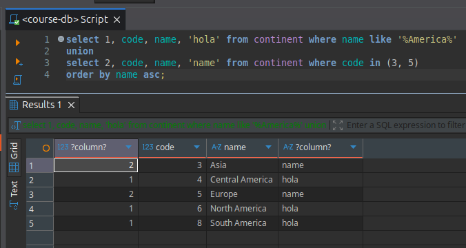
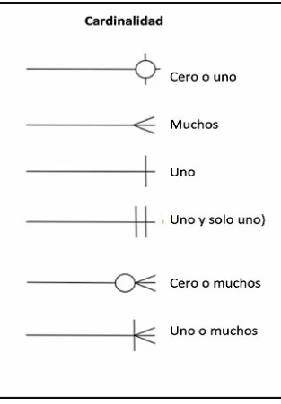

# Curso de Bases de Datos con PostgreSQL

<div align="center">

</div>

## Pasos para levantar el proyecto

1. Tener docker Desktop o el demonio de Docker corriendo
2. Clonar el proyecto
3. Navegar a la carpeta del proyecto
4. crear volumenes

```zsh
  docker volume create pgadmin
  docker volume create postgres
```

5. Ejecutar `docker compose up -d`

6. Revisar el **archivo docker-compose.yml** para los usuarios y contraseñas

## Indices de la guia de SQL con postgreSQL

- [Conceptos Generales y Terminologias](#conceptos-generales-y-terminologias-sql)
- [Agregate Functions](#agregate-functions)
- [Filtering Fuctions](#filtering-functions)
- [Estructura De Un Select](#estructura-de-un-select)
- [SubQueries](#subqueries)
- [Definicion de constraints](#definicion-de-constraints)
- [Relaciones](#relaciones)
- [Llaves](#llaves)
- [Uniones y Joins](#uniones-y-joins)
- [Fechas, Intervalor y funciones sobre fechas](#fechas-intervalos-y-funciones-sobre-fechas)
- [Case When](#case-when)
- [Generacion de llaves primarias](#generacion-de-llaves-primarias)
- [Diagramas Entidad Relacion](#diagramas-entidad-relacion)

## Tener en cuanta

todo lo que hacemos en comandos SQL mayormente se pueden hacer desde la GUI que usemos ya sea DBeaver, Table Plus, PgAdmin, MySQL workbrench etc

o tambien utilizando algun ORM (Object Relational Mapping) en nuestro lenguaje de programacion favorito como con prisma en NodeJS, SQLAlchemy en Python o Hibernate en Java

## Creditos

Esta informacion esta sacada del curso de Fernando Herrera de su curso de SQL desde cero

[Link al curso de SQL](https://www.udemy.com/course/sql-de-cero)

## Conceptos Generales y Terminologias SQL

DDL: Data Definition Language Ejemplos: Create, Alter, Drop, Truncate

DML: Data Manipulation Language Ejemplos: Insert, Delete, Update

TCL: Transaction Control Language Ejemplos: Commit, Rollback

DQL: Data Query Language Ejemplos: Select

DBA: Data Base Administrator

## Agregate Functions

- Count
- Sum
- Max
- Min
- Group By
- Having
- Order By

## Filtering Functions

- Like
- In
- Is Null
- Is Not Null
- Where
- And
- Or
- Between

## Estructura De Un Select

```sql
select * || distinct, campos alias funciones
where condicion, condiciones and or in like
join
group by campo agrupador, All
having condicion
order by expresion asc, desc
limit valor, all
offset punto de inicio
```

## SubQueries

Son querys ejecutadas dentro de una query que se pueden colocar en cualquier parte donde se selecciona una columna

```sql
select * from tablaA where (subquery from tablaB)
```

tenemos que tener cuidado con esto ya que si la subquery hace una consulta grande puede ser limitante para el rendimiento

## Definicion de Constraints

Las constraints no son mas que restricciones para nuestra base de datos para asegurar de tener datos limpios y usables y no llenar nuestra base de datos de pura basura

## Relaciones

- Uno a Uno - One to One Ejemplo un estudiante tiene una informacion de contacto y una informacion de contacto le pertenece a un estudiante
- Uno a Muchos - One to Many Ejemplo un cliente tiene muchas ordenes y una orden pertenece a un cliente
- Relaciones a si mismas - Self Joining Relationships Ejemplo que usuario modifico a cierto usuario en una misma tabla
- Muchos a Muchos - Many to Many Ejemplo un estudiante tiene muchas clases y una clase tiene muchos estudiantes pueden haber tablas intermedias para hacer referencia a las 2 tablas

### Ejemplo

<div align="center">

</div>

- Country ↔ City (1:N): Un país puede tener múltiples ciudades registradas, pero cada ciudad está asociada de forma única a un país mediante su countrycode.

- Country ↔ CountryLanguage (1:N): Un país puede poseer diversos idiomas oficiales o hablados, mientras que cada entrada de idioma se vincula específicamente a un código de país.

Las relaciones dependen del requerimiento del proyecto

## Llaves

- Primary Key
- Super Key
- Candidate Key
- Foreign Key
- Composite Key

Hay mas y todas las llaves sirven para identificar registros Entre otras: Alternate Key, Artificial Keys

### Primary Key

- Identifica un registro de forma unica
- Una tabla puede tener varios identificadores unicos
- La llave primaria es basada en los requerimientos

### Candidate Key

- Un atributo o conjunto de ellos que identifican de forma unica
- Menos la llave primaria los demas se consideran llaves candidatas

### Super Key

- Es un conjunto de atributos que puede identificar de forma unica
- Es un superconjunto de una clave candidata

### Foreign Key

- Llaves foraneas son usadas para apuntar a la llave primaria de otra tabla
- si hacemos referencia de la llave primaria en una tabla debe ser del mismo tipo de dato y longitud

### Composite Key

- Cuando una clave primaria consta de mas de un atributo, se conoce como clave compuesta

## Index - Indices

Imaginemos un libro, si el libro no tiene capitulos, para encontrar un tema en especifico tendriamos que leer el libro completo hasta encontrar lo que queremos, en cambio si el libro tiene capitulos marcados sera facil llegar a lo que queremos

Si asignamos un indice a una columna en nuestra base de datos por ejemplo en email, la base de datos crea una estructura separada (usualmente en B-Tree o Arbol Balanceado) esta estructura guarda los valores de los emails ordenados y un "puntero" (la direccion fisica) hacia donde esta el resto de la fila en el disco duro

proceso para recordar: internamente al crear un indice la base de datos guarda la posicion ordenada de cada dato de la columna indexada para acceder facilmente a ella

## Uniones y Joins

### Join

Un JOIN se utiliza cuando quieres combinar columnas de dos o más tablas basándote en una relación entre ellas (generalmente a través de llaves primarias y foráneas). Imagina que pegas una tabla al lado de la otra.

Tipos principales de JOIN:

- INNER JOIN: Devuelve solo las filas donde hay una coincidencia en ambas tablas. Si un registro no tiene "pareja" en la otra tabla, queda fuera.

- LEFT JOIN (o Left Outer Join): Devuelve todos los registros de la tabla de la izquierda y los registros coincidentes de la tabla de la derecha. Si no hay coincidencia, verás valores NULL.

- RIGHT JOIN: Es lo opuesto al anterior: todos los de la derecha y los que coincidan de la izquierda.

- FULL JOIN: Devuelve todos los registros cuando hay una coincidencia en una de las tablas. Básicamente, una combinación total.

### Outer Joins

Los Outer Joins son extensiones de los JOINs básicos que te permiten recuperar datos incluso cuando no existe una coincidencia perfecta entre las tablas.

Mientras que un INNER JOIN es estricto (solo muestra lo que coincide en ambos lados), los Outer Joins son más "permisivos" y mantienen las filas que de otro modo se perderían.

1. LEFT OUTER JOIN (o simplemente LEFT JOIN)
   - Es el más común de todos. Devuelve todas las filas de la tabla de la izquierda (la primera que mencionas) y las filas que coincidan de la tabla de la derecha.

   - ¿Qué pasa si no hay coincidencia? SQL rellena las columnas de la tabla derecha con valores NULL.

   - Caso de uso: "Quiero ver a todos los clientes y sus pedidos, incluyendo a los clientes que no han comprado nada todavía".

2. RIGHT OUTER JOIN (o simplemente RIGHT JOIN)
   - Es exactamente lo contrario al anterior. Devuelve todas las filas de la tabla de la derecha y las filas que coincidan de la izquierda.

   - ¿Qué pasa si no hay coincidencia? Las columnas de la tabla izquierda aparecerán como NULL.

   - Curiosidad: Casi no se usa en la práctica, porque cualquier RIGHT JOIN se puede escribir como un LEFT JOIN simplemente cambiando el orden de las tablas en la consulta.

3. FULL OUTER JOIN
   - Este es el más inclusivo de todos. Devuelve registros cuando hay una coincidencia en cualquiera de las tablas.

   - Si hay coincidencia, une las filas.

   - Si un registro de la izquierda no tiene pareja, lo muestra y rellena la derecha con NULL.

   - Si un registro de la derecha no tiene pareja, lo muestra y rellena la izquierda con NULL.

   - Caso de uso: Sincronización de inventarios o encontrar discrepancias totales entre dos listas.

### Diagrama Veen Joins

<div align="center">


</div>

### Uniones

cuando hablamos de Uniones (específicamente el comando UNION), nos referimos a la técnica para combinar los resultados de dos o más consultas en un único conjunto de datos final.

A diferencia de los JOINs, que pegan tablas de forma lateral (añadiendo columnas), las uniones pegan los resultados de forma vertical (añadiendo filas una debajo de otra).

<div align="center">

</div>

en el ejemplo anterior unimos los resultados de 2 consultas a una misma tabla, ojo la seleccion de columnas debe coincidir en ambos ya que si no no podremos realizar dicha consulta, es decir si en la primera tenemos code, name en la segunda podriamos tener code, name pero tambien podemos hacer la union con un dato diferente pero debe cumplir con el requerimiento de ser del mismo tipo de dato

<div align="center">

</div>

## Fechas, Intervalos y funciones sobre fechas

hacer consultas sobre fechas es super importante cuando nos piden actualizar dicha informacion de una tabla ya sea sumando años o obteniendo informacion por rango de fechas

al igual que el resto de datos podemos hacer condiciones o usar funciones de agregacion como sum() o ocupar condiciones como un between

el formato de la fecha depende del motor de base de datos que estemos usando en el caso de PostgreSQL el formato de una fecha sera 'yyyy-MM-dd'

### Funciones de fechas comunes

1. Obtener el tiempo actual
   - now() = devuelve la fecha y hora actual (con zona horaria)
   - current_date = solo fecha (yyyy-MM-dd)
   - current_time = solo la hora

2. Extraccion de partes (EXTRACT)

   ```sql
   SELECT EXTRACT(YEAR FROM fecha) as anio,
         EXTRACT(MONTH FROM fecha) as mes,
         EXTRACT(DAY FROM fecha) as dia
   FROM ventas;
   ```

   - Dato Util: tambien se puede extraer `DOW` (Day of Week) donde 0 es domingo

3. Redondeo de fechas (DATE_TRUNC)
   - Esta es la favorita de los backends para reportes "trunca" una fecha al inicio de un periodo si tienes `2024-05-15 14:30:00` y truncas por `month` obtienes `2024-05-01 00:00:00`

   ```sql
   -- Ideal para agrupar ventas por mes
   SELECT DATE_TRUNC('month', fecha_venta), SUM(total)
   FROM ventas
   GROUP BY 1;
   ```

4. Aritmetica de fechas (Intervalos)
   - Postgres es muy humano para esto puedes sumar o restar tiempo usando la palabra reservada `interval`

   - Sumar tiempo: `fecha + interval '30 days'`

   - restar tiempo: `now() - interval '1 year'`

   - saber la edad/antiguedad: `AGE(fecha_nacimiento)` (devuelve años meses y dias transcurridos)

5. Formateo de fechas (TO_CHAR)
   - Para cuando necesitas que la base de datos te devuelva el texto "bonito" directamente

   ```sql
   SELECT TO_CHAR(NOW(), 'DD/MM/YYYY HH12:MI AM');
   -- Resultado: 27/04/2026 09:25 PM
   ```

#### Resumen

| Necesidad               |           Funcion en Postgres |
| :---------------------- | ----------------------------: |
| ¿Que Hora es?           |                       `now()` |
| Sumar 15 dias           |        `+ interval '15 days'` |
| sacar solo el mes       |     `extract(month from ...)` |
| primer dia del mes      |    `date_trunc('month', ...)` |
| diferencia entre fechas | `fecha_a - fecha_b` o `age()` |

## CASE, WHEN

el case when sirve para condicionar y dar un resultado en una columna en base a condiciones, un ejemplo claro es dar un rango de experiencias y dar un resultado legible y no solo decir '6 years'

```sql
select
  first_name,
  last_name,
  hire_date,
  case
    when hire_date > now() - interval '1 year' then '1 año o menos'
    when hire_date > now() - interval '3 year' then '1 a 3 años o menos'
    when hire_date > now() - interval '6 year' then '3 a 6 años'
    else '+ de 6 años'
  end as rango_antiguedad
from
  employees
order by
  hire_date desc;
```

en el ejemplo anterior el case when sirve para dar informacion del rango de antiguedad pero de forma mas explicita, funciona como un switch de los lenguajes de programacion

## Generacion de llaves primarias

### Serial VS Identity

1. Serial (la forma tradicional de Postgres)

   `serial` no es un tipo de dato real es un atajo o alias cuando creas una columna con `serial` postgres hace tres cosas por ti
   1. Crea un objeto SEQUENCE separado

   2. Establece el valor por defecto en la columna usando la funcion `nextval()`

   3. Agrega una restriccion de `NOT NULL`

   Problema principal: Como la secuencia es un objeto independiente, si borras la columna o intentas manipularla, a veces la secuencia queda "huérfana" o se vuelve difícil de gestionar. Además, no es un estándar de SQL, es algo exclusivo de Postgres.

2. GENERATED ALWAYS AS IDENTITY (El estandar SQL)

   Introducido en Postgres 10, es la forma compatible con el estándar ANSI SQL. Es lo que deberías usar hoy en día.

   Existen dos variantes:
   - `GENERATED BY DEFAULT AS IDENTITY`: Permite que tú insertes un ID manualmente si quieres, pero si no lo haces, él genera uno.

   - `GENERATED ALWAYS AS IDENTITY`: Es más estricto. Si intentas insertar un ID manualmente, te dará un error (a menos que uses un comando especial). Esto protege la integridad de tus datos.

   puedes mofificar su incremento y inicio a la hora de crear la tabla con lenguaje SQL

   ```sql
   create table users4 (
    user_id integer generated always as identity (start with 100 increment by 2),
    username varchar
   );
   ```

### Llaves Compuestas

La generacion de llaves compuestas nos asegura que la combinacion de 2 llaves no sea nunca repetida, pueden repetirse en campos pero la combinacion de ambas nunca podra ser igual en 2 registros

```sql
create table usersDual(
  id1 int,
  id2 int,
  primary key (id1, id2)
);
```

en el ejemplo anterior el id1 y id2 representan una combinacion unica de un registro lo cual provoca que pude haber un registro como `1 | 2` pero este no se podra repetir

### UUID

El UUID (Universally Unique Identifier) es un estándar de identificación diseñado para que un ID sea único en todo el mundo, sin necesidad de que una base de datos central le diga "este número te toca a ti".

Si el `SERIAL` o el `IDENTITY` son como el número de turno en una fila (1, 2, 3...), el UUID es como el ADN o la huella dactilar de un registro.

1. Ventajas de los UUID:
   - Seguridad por oscuridad: Si tu URL es misitio.com/factura/100, un hacker puede adivinar que la factura 101 existe. Con un UUID (misitio.com/factura/a1b2-c3d4...), es imposible adivinar el siguiente ID.

   - Sincronización: Si tienes una App móvil que funciona offline, el teléfono puede generar el UUID del registro antes de enviarlo al servidor. Si usaras números, el teléfono no sabría qué número sigue en la base de datos.

   - Escalabilidad: En sistemas distribuidos (microservicios), diferentes servidores pueden crear registros al mismo tiempo sin miedo a que se repita el ID.

2. Desventajas:
   - Espacio: Un BIGINT ocupa 8 bytes; un UUID ocupa 16 bytes. Esto hace que la base de datos crezca más rápido.

   - Rendimiento de Índice: Los UUID (especialmente la versión 4) son aleatorios. Esto hace que insertar datos sea más lento que con números ordenados (1, 2, 3...), porque la base de datos tiene que "reordenar" el índice constantemente.

3. Versiones de UUID:

   No todos los UUID se crean igual, los mas comunes son:
   - V1: Basado en el tiempo y la dirección MAC de la computadora.

   - V4 (El más usado): Es totalmente aleatorio. Hay tantas combinaciones ($2^{122}$) que la probabilidad de que dos personas generen el mismo es prácticamente cero.

   - V7 (La tendencia actual): Es una mezcla. Incluye una parte basada en el tiempo (ordenada) y una parte aleatoria.

#### Como generar UUID en PostgreSQL

en postgres no viene por defecto la funcion para generar UUIDs, para ello debemos agregar una extension llamada `"uuid-ossp"`

para agregarla usamos el siguiente comando en SQL

```sql
create extension if not exists "uuid-ossp";
```

si queremos eliminar la extension en caso de cualquier cosa

```sql
drop extension "uud-ossp";
```

y para crear una tabla y generar los UUIDs de forma automatica ocupamos la siguiente sintaxis

```sql
create table users5 (
  user_id UUID default uuid_generate_v4() primary key,
  username varchar
);
```

el llamado a la funcion depende de que version de UUID queremos usar

### Secuencias

Las secuencias son en pocas palabras lo que hace el `SERIAL` pero creandolo de forma manual y asignando la funcion que crea por defecto el siguiente valor de forma manual a la hora de crear la tabla con SQL

1. Creacion de un sequence

   ```sql
   create sequence <nombre_secuencia>;
   ```

2. Eliminacion de un sequence

   ```sql
   drop sequence user_sequence;
   ```

Funciones de los sequence

- `nextval(<sequence>)`: al llamar a la funcion nos devuelve el siguiente numero de la secuencia, pero al llamar a este, ya no se asignara este numero a la siguiente llamada del metodo, esto es lo que usa por debajo SQL al hacer una creacion de ID automatico con `SERIAL`

- `currval(<sequence>)`: esta funcion nos devuelve el valor actual de la secuenci sin gastar su valor, dejandolo para la siguiente creacion de entidad en una tabla

Insertar un sequence a la hora de crear una tabal

```sql
create table users6 (
  user_id integer primary key default nextval(<sequence>),
  username varchar
);
```

resetear sequence

```sql
ALTER SEQUENCE <nombre_de_tu_secuencia> RESTART WITH 1;
```

## Diagramas Entidad Relacion

Este tipo de diagramas explica como cada entidad (tabla) se relaciona con otra entidad (otra tabla) por eso el nombre de Diagramas Entidad Relacion

### Cardinalidad y Ordinalidad

<div align="center">

</div>

### Software para crear Diagramas Entidad Relacion (explicacion de sus tier gratuitos)

1. [dbdiagram.io](https://dbdiagram.io/home)
2. [Diagrams.net (formerly Draw.io)](https://app.diagrams.net/)
3. [Lucidchart](https://www.lucidchart.com/pages/)
4. [QuickDBD](https://www.quickdatabasediagrams.com/)
5. [ERDPlus](https://erdplus.com/)
6. [Cacoo](https://nulab.com/cacoo/examples/database-diagrams-er-diagram-tool/)
7. [Drawsql.app](https://drawsql.app/)
8. [Miro](https://miro.com/)
9. [gliffy](https://www.gliffy.com/solutions/diagrams-for-software-engineering)
10. [Creately](https://creately.com/)
